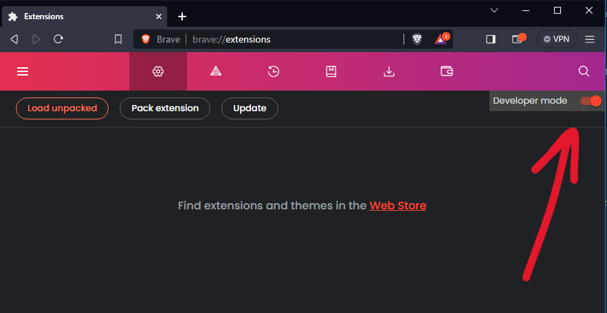
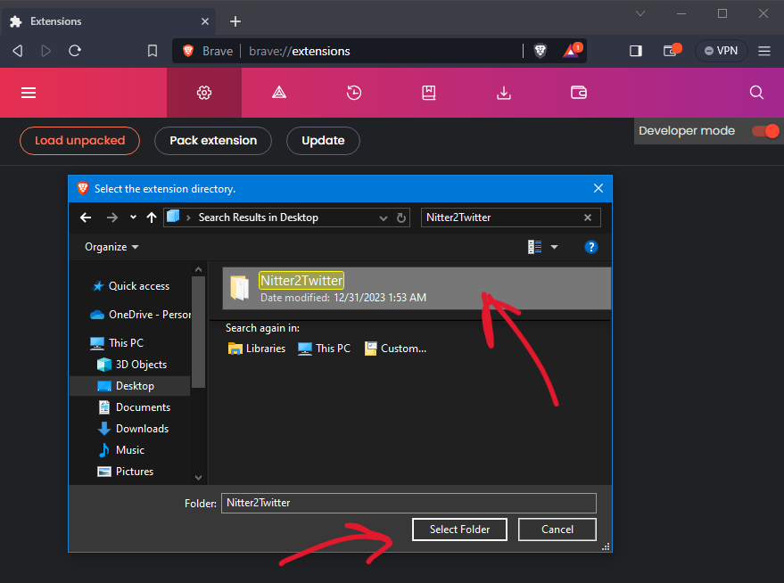
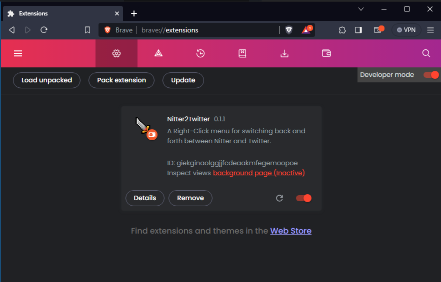
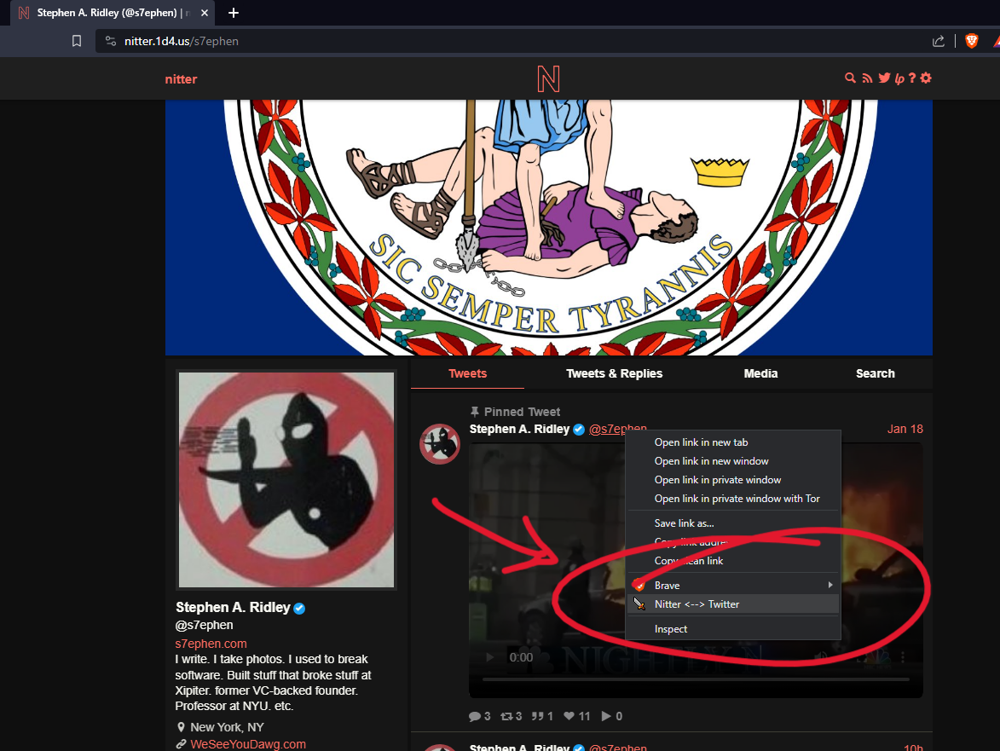

# Nitter2Twitter

A Chrome/Brave plugin to right-click twitter links and open them on Nitter...
and vice versa: right-click Nitter links and open them in Twitter.

It's stupid simple, so if you wanna improve it (like add logic to the javascript, nest the context-menu, etc) please feel free 
and do a pull request.

# Why?

If you miss the ability to anonymously scroll through Twitter timelines
and read tweet comments without being logged in, then you probably have 
been using Nitter.

If you have been using Nitter then you also know that some things (like video playback)
work better when viewed directly on twitter. Or maybe after browsing on Nitter, you want to
comment on something using your authenticated Twitter session.

This just flips back and forth with a right-click context menu.

# Install
1. Clone this repo or if you dont wanna do that you can just download [this zip file.](https://github.com/s7ephen/nitter2twitter/raw/main/Nitter2Twitter.zip)
2. Unzip the zip file to it's own directory "Nitter2Twitter"
3. Open the [Chrome Extensions Menu](chrome://extensions). `chrome://extensions`
4. Flip the "Developer Switch" which lets you use your own extensions without the "Extension Store".

5. Click "Load Unpacked" Extension
6. When the Directory selection pops up, select the "Nitter2Twitter" directory you .zip was unzipped to.

7. The Extension should now be loaded.

7. Load Nitter or Twitter and right click on a link.

 
# Credit
The icons are from: https://kyrise.itch.io/kyrises-free-16x16-rpg-icon-pack
I was gonna use a [Dwarf Fortress](https://en.wikipedia.org/wiki/Dwarf_Fortress) icon, but decided against it ;-)
